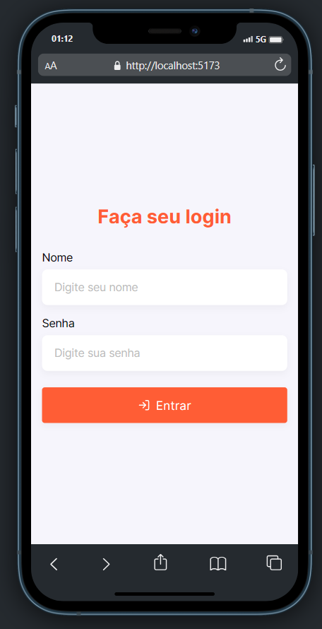
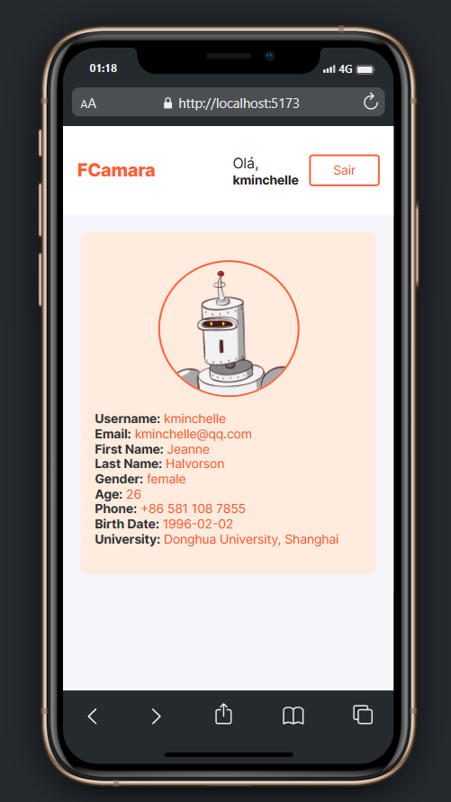
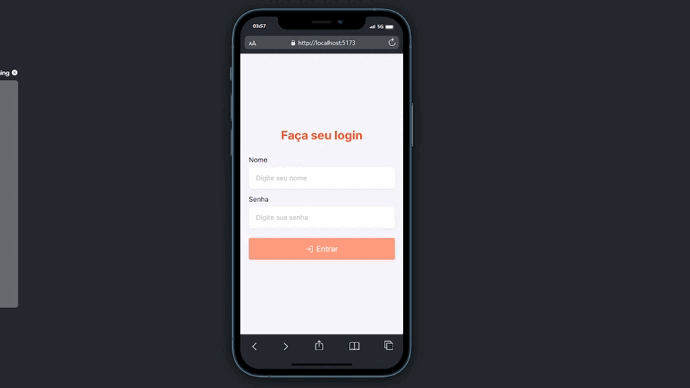
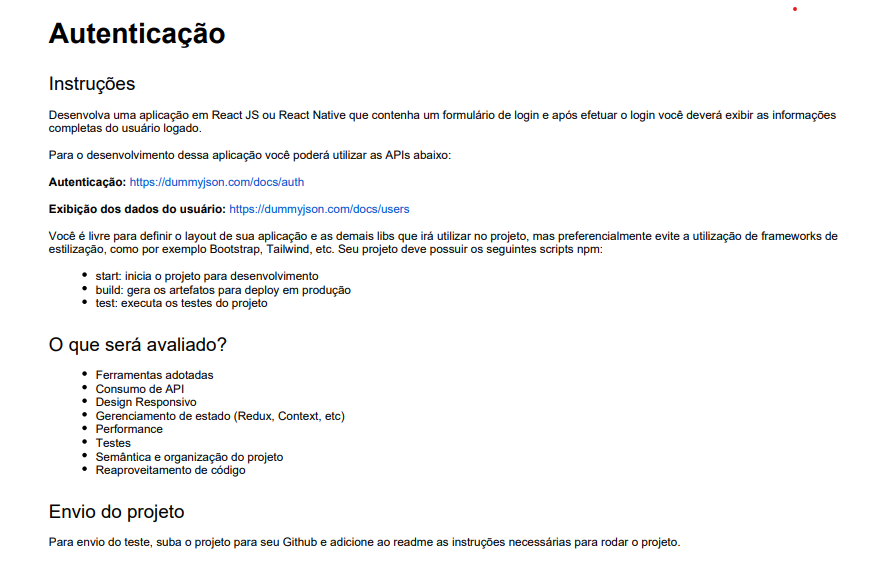

<h3 align="center">
    <b>Sistema de Autenticação de usuario</b>
</h3>

# Índice

- [Sobre](#sobre)
- [Tecnologias Utilizadas](#tecnologias-utilizadas)
- [Como Usar](#como-usar)
- [Como Contribuir](#como-contribuir)

## :bookmark: Sobre

<strong>Sistema de Autenticação de Usuário - Esta aplicação web, desenvolvida em ReactJS com TypeScript, permite a autenticação de usuários. Apresenta um formulário de login, onde os usuários podem realizar o login. Após a autenticação bem-sucedida, a aplicação exibe detalhes completos do usuário logado.</strong>

## :heavy_check_mark: :iphone: Versão Web

<h1 align="center">
    
    
    
    
</h1>

## :heavy_check_mark: :iphone: Video

<h1 align="center">
    
</h1>

## Credencias que devem ser utilizdas para fazer login:

```sh
 - usuario 01:
   username: 'kminchelle',
   password: '0lelplR',

 - usuario 02:
   username: 'atuny0',
   password: '9uQFF1Lh',
```

### Requisitos

<h1 align="center">
    
</h1>

- [x] interface construida com React, typescript e Styled-components
- [x] tela de Login
- [x] incluir as cores e fonts da interface
- [x] Integração entre front-end com Api
- [x] A página deve ser responsiva;
- [x] testes automatizados
- [x] Adicionando o formik
- [x] Adicionando validação com Yup
- [x] Implementação de Toast para aprimorar a experiência do usuário ao afzer login
- [x] Adicionando component de loader para mostrar o carregamento
- [x] Gerenciamento de estado (Context)
- [x] Dados de usuario logado salvo no LocalStorage
- [x] Dados de usuario logado exibido em tela

<a id="tecnologias-utilizadas"></a>

## :rocket: Tecnologias Utilizadas

O projeto foi desenvolvido utilizando as seguintes tecnologias

- [React](https://react.dev/)
- [Typescript](https://www.typescriptlang.org/docs/handbook/typescript-in-5-minutes.html)
- [Styled-components](https://styled-components.com/)

<a id="como-usar"></a>

## :fire: Como usar

1. Faça um clone :

```sh
  $ git clone https://github.com/Rafael-Rufino/teste-desafio-fcamara.git
```

2. Executando a Aplicação:

```sh
  # Instale as dependências
  $ npm install
  ou
  $ Yarn

  # Inicie a aplicação web
  $ cd web
  $ yarn start
  ou
  $ npm run start

```

3. Executando os testes:

```sh
  # rodando os testes
  $ yarn test
  ou
  $ npm run test
```

<a id="como-contribuir"></a>

# :recycle: Como contribuir

- Faça um Fork desse repositório,
- Crie uma branch com a sua feature: `git checkout -b my-feature`
- Commit suas mudanças: `git commit -m 'feat: My new feature'`
- Push a sua branch: `git push origin my-feature`

---

<h4 align="center">
    Feito com 💜 by <a href="https://www.linkedin.com/in/rafael-r-dos-santos/" target="_blank">Rafael Rufino</a>
</h4>
